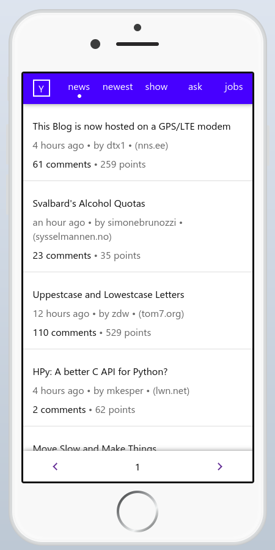

# Simply Building a Hackernews PWA

This tutorial explains how to build a complete progressive web application with SimplyEdit in just 200 lines of HTML and javascript.

> Things you'll learn:
> - Single Page Application Routing
> - Connecting to a REST API
> - Rendering nested data recursively 
> - Using SimplyEdit Transformers to customize the rendering of data
> - How to change state with buttons and commands

Hackernews is the common name for the website https://news.ycombinator.com/. It is a hub for developers and technology enthousiasts. It is also the subject for the https://hnpwa.com/ website.

The HNPWA.com website describes a [progressive web application (PWA)](https://en.wikipedia.org/wiki/Progressive_web_application) and challenges you to make it using any web application framework. The end result will look like this:




The goal of the HNPWA app is to show news items and comments from hackernews. We don't have to scrape the website. There are a number of public API's that provide the data. This tutorial uses https://api.hackerwebapp.com/. This API closely matches how you want to display news and comments in an application.


## Setting up

First make a simple webpage with the needed libraries:

```html
<!doctype html>
<html lang="en">
<meta charset="utf-8">
<title>Hackernews PWA with SimplyEdit</title>
<body>

<script src="https://cdn.simplyedit.io/1/simply-edit.js"
    data-simply-storage="none"
></script>
<script src="https://unpkg.com/simplyview@2.0.0/dist/simply.everything.js"></script>
</body>
</html>
```

It is good practice to define the language and character set in any webpage. The two main javascript libraries used here are SimplyEdit itself, and SimplyView as `simply.everything.js`. SimplyEdit is used without a storage engine. This web app doesn't need the content management functionality. SimplyView packs a lot of tools specific for web applications.

## Create a base application

SimplyView provides a simple application skeleton. Set it up like this:

```html
<script>
    const hnpwa = simply.app({
    });
</script>
```

To get it do anything, add a route:

```html
<script>
    const hnpwa = simply.app({
        routes: {
            '/:*': function(params) {
                alert('Hello world');
            }
        }
    });
</script>
```

Great, that works. The next part explains how to connect to the API and show a list of hackernews news items. 

## Connecting to a REST API

SimplyView has a library -- simply.api -- to simplify talking to a remote API, like the one at https://api.hackerwebapp.com/. In most cases all you need to do is to set it up like this:

```html
<script>
    var hnapi = simply.api.proxy({
        baseURL: 'https://api.hackerwebapp.com/'
    });
</script>
```

The hackerwebapp team has a documentation page at https://github.com/cheeaun/node-hnapi/wiki/API-Documentation. This lists a `/news` path that returns a list of the 30 most recent popular news items. With the new `hnapi` the code looks like this:

```html
<script>
    var hnpwa = simply.app({
        routes: {
            '/:*': function(params) {
                hnapi.news()
                .then(result => console.log(result));
            }
        }
    });
</script>
```

Reload the page and check that your browser console shows a list of news items. You may be wondering what happens here. Where does that `news()` method come from? Simply.api uses a new javascript feature called a [Proxy](https://developer.mozilla.org/en-US/docs/Web/JavaScript/Reference/Global_Objects/Proxy). With this you can intercept method calls, even if they are undefined.


In this case there is no `news` property or method, but simply.api intercepts it instead and appends the name -- news -- to the baseURL. The new URL is now https://api.hackerwebapp.com/news/. 

Then simply.api intercepts the call to that property as a method. By default it will then send a GET request to this URL. It also parses the results as JSON -- you can configure it do otherwise. Then it returns the result as a Promise.

You can also do POST requests, or any other HTTP method. You can  handle XML results, or HTML. Check out [the documentation for simply.api](https://github.com/SimplyEdit/simplyview/blob/master/docs/simply.api.md) for an overview of its features.

## Rendering news items

The next step is showing the news items. News items contain a number of properties. Here is the JSON for a news item from the https://api.hackerwebapp.com/ site.

```json
{
    "id": 26452504,
    "title": "Reprojecting the Perseverance landing footage onto satellite imagery",
    "points": 389,
    "user": "bmease",
    "time": 1615692065,
    "time_ago": "10 hours ago",
    "comments_count": 24,
    "type": "link",
    "url": "https://matthewearl.github.io/2021/03/06/mars2020-reproject/",
    "domain": "matthewearl.github.io"
}
```

There is now a list of news items in the base route. So lets create a list template to display them:

```html
<body>
<ul data-simply-list="items">
<template>
    <li>
        <span data-simply-field="title">title</span>
    </li>
</template>
</ul>
```

And render the items:

```html
<script>
    var hnpwa = simply.app({
        routes: {
            '/:*': function(params) {
                hnapi.news()
                .then(result => {
                    hnpwa.view.items = result;
                );
            }
        },
        view: {
            items: []
        }
    });
</script>
```
The `view`section of simply.app links data to SimplyEdits `data-simply-field`and `data-simply-list`using two-way databinding. This means that `hnpwa.view.items`is automatically rendered using the template linked to `data-simply-list="items"`. Whenever you change `view.items`, SimplyEdit updates the HTML automatically.

> :bulb: You should not initialize a view variable as `null`. Always use a value -- a string, int, array or object. This is because SimplyEdit cannot monitor `null` for changes.

You can checkout the results so far in this codepen: https://codepen.io/poef/pen/abBMpKN.

## Adding links

The best reason to read Hackernews is to read the comments. So let's add a link to each news item to show the comments for that item.

According to the api.hackerwebapp.com documentation, the url: `https://api.hackerwebapp.com/item/:id` returns all the data for a news item, including all comments. The route that handles this looks like this:

```javascript
    '/#comments/:id': function(params) {
        hnapi.item[params.id]()
        .then(result => {
            hnpwa.view.item = result;
        });
    },    
```

Then add a link like this to the news items. There is no such link in the JSON for an item. There is an id, though.

A simple -- but wrong -- way to fix this is to add it in the news item data, e.g.:

```javascript
    '/:*': function(params) {
        hnapi.news()
        .then(result => {
            // this is an example of what not to do!
            result.forEach(item => {
                item.comment_link = '#comments/'+item.id
            });
            hnpwa.view.items = result;
        );
    }
```

In general, you should not change the data because of the way you want to render it. SimplyEdit provides a better alternative: transformers.

```html
<script>
    editor.transformers.comment_link = {
        render: function(data) {
            return '/#comments/'+data;            
        }
    };
</script>
```

And now add the link to the HTML:

```html
<ul data-simply-list="items">
<template>
    <li>
        <a data-simply-field="id"
           data-simply-transformer="comment_link" 
           data-simply-content="fixed">
            <span data-simply-field="title">title</span>
        </a>
    </li>
</template>
</ul>
```

This extends the original html template for news items with an anchor (`<a>`) element. This anchor has a `data-simply-field="id"` which normally would render the id as the `href` attribute. But here the `comment_link`  transformer modifies this so that instead the id is transformed into the `/#comments/:id` link. 

Normally a field on an anchor also sets the innerHTML. But here the innerHTML is already set with another field, the title. The `data-simply-content="fixed"` attribute tells SimplyEdit to not touch the innerHTML of the anchor.

Now let's show the item and comments. You could add an extra div and use a class to switch between the two, like this:

```html
<section class="items selected">
    <ul data-simply-list="items">
    <template>
        <li>
            <a data-simply-field="id"
               data-simply-transformer="comment_link" 
               data-simply-content="fixed">
                <span data-simply-field="title">title</span>
            </a>
        </li>
    </template>
    </ul>
</section>
<section class="item">
    <h2 data-simply-field="item.title">
        Title
    </h2>
</section>
```

And with a bit of CSS, you can switch between which part is visible. But often it is simpler to use SimplyEdit's template feature to alter the DOM based on a variable:

```html
<section data-simply-field="show" data-simply-content="template">
    <template data-simply-template="items">
        <ul data-simply-list="items">
        <template>
            <li>
                <a data-simply-field="id"
                   data-simply-transformer="comment_link" 
                   data-simply-content="fixed">
                    <span data-simply-field="title">title</span>
                </a>
            </li>
        </template>
        </ul>
    </template>
    <template data-simply-template="item">
        <h2 data-simply-field="item.title">
            Title
        </h2>
    </template>
</section>
```

> :bulb: The item title is shown with the field `item.title`, not `title`, like in the news items list. Only in templates used in a `data-simply-list` are the `data-simply-field` values automatically scoped to the each item in the list. Outside a list, all fields are scoped to the view root.

And now just set the `hnpwa.view.show` variable to select which template is shown:

```javascript
    '/#comments/:id': function(params) {
        hnapi.item[params.id]()
        .then(result => {
            hnpwa.view.item = result;
            hnpwa.view.show = 'item';
        });
    },    
```

You must also add this to the default route, so the `items` template is selected. The whole app now becomes:

```html
<script>
    var hnpwa = simply.app({
        routes: {
            '/#comments/:id': function(params) {
                hnapi.item[params.id]()
                .then(result => {
                    hnpwa.view.item = result;
                    hnpwa.view.show = 'item';
                });
            },
            '/:*': function(params) {
                hnapi.news()
                .then(result => {
                    hnpwa.view.items = result;
                    hnpwa.view.show  = 'items';
                });
            }
        },
        view: {
            items: [],
            item: {},
            show: 'items'
        }
    });
</script>
```

Check out the full code in this codepen: https://codepen.io/poef/pen/YzpmZRZ

## Showing Comments

The comments in hackernews are nested. You can comment directly on a news item, or on a comment from someone else. This means that there is a tree structure of data, like this:

```json
{
    "comments": [
        {
            "id": 26535175,
            "level": 0,
            "user": "sillysaurusx",
            "time": 1616370023,
            "time_ago": "8 hours ago",
            "content": "<p>Please test their models...",
            "comments": [
                {
                    ...
                }
            ]
        }
    ]
}
```

If you have a list of data, you can render these use `data-simply-list` and a template:

```html
<ul data-simply-list="item.comments">
    <template>
        <li>
            <span class="user" data-simply-field="user"></span>
            <span class="time" data-simply-field="time_ago"></span>
            <span class="content" data-simply-field="content"></span>
        </li>
    </template>
</ul>
```

But if you want to show a nested list of comments, you would need to repeat the template for each level, e.g:

```html
<ul data-simply-list="comments">
    <template>
        <li>
            <span class="user" data-simply-field="user"></span>
            <span class="time" data-simply-field="time_ago"></span>
            <span class="content" data-simply-field="content"></span>
            <ul data-simply-list="comments">
                <template>
                    <li>
                        <span class="user" data-simply-field="user"></span>
                        <span class="time" data-simply-field="time_ago"></span>
                        <span class="content" data-simply-field="content"></span>
                        <ul data-simply-list="comments">
                            <template>
                                <li>
                                    <span class="user" data-simply-field="user"></span>
                                    <span class="time" data-simply-field="time_ago"></span>
                                    <span class="content" data-simply-field="content"></span>
                                    ...
                                </li>
                            </template>
                        </ul>
                    </li>
                </template>
            </ul>
        </li>
    </template>
</ul>
```

That is clearly not ideal. There is no set limit to how many levels of comments hackernews supports, so even if you go overboard and add 100 levels, you might still have some comments not showing, because they are at level 101 or higher.

Instead SimplyEdit supports named templates, which can refer to themselves, like this:

```html
<ul class="comments root" data-simply-list="comments">
    <template rel="comment"></template>
</ul>
<template id="comment">
    <li>
        <span class="user" data-simply-field="user"></span>
        <span class="time" data-simply-field="time_ago"></span>
        <span class="content" data-simply-field="content"></span>
    </li>
</template>
```

No you can add a comments subtree to a comment, simply by referring to its own template, like this:

```html
<ul class="comments root" data-simply-list="item.comments">
    <template rel="comment"></template>
</ul>
<template id="comment">
    <li>
        <span class="user" data-simply-field="user"></span>
        <span class="time" data-simply-field="time_ago"></span>
        <span class="content" data-simply-field="content"></span>
        <ul class="comments" data-simply-list="comments">
            <template rel="comment"></template>
        </ul>
    </li>
</template>
```

Because comment threads can go off topic quickly, you might want to skip some comments and their threads. You could build a custom collapse thread feature in javascript. But why not use the [HTML details/summary elements](https://developer.mozilla.org/en-US/docs/Web/HTML/Element/details):

```html
<div class="comments root" data-simply-list="item.comments">
    <template rel="comment"></template>
</div>
<template id="comment">
    <details class="comment" open>
        <summary>
            <span data-simply-field="user">user</span>
            <span data-simply-field="time_ago">10</span> minutes ago
            <div class="content" data-simply-field="content">Content</div>
        </summary>
        <div class="comments" data-simply-list="comments">
            <template rel="comment"></template>
        </div>
    </details>
</template>
```

This adds collapsing threads without any extra code. Take a look at the current code in this codepen: https://codepen.io/poef/pen/eYgOdKx

## Adding a menu

Hackernews has a limited number of categories for news items:

- news
- newest
- ask
- show
- jobs

The category `news` is the main category, which contains all the rest, but ordered on popularity and actuality. The other categories are a subset.

These categories are supported by the API. Let's add a menubar to switch between them:

```html
<header>
    <nav class="navbar">
        <ul class="toolbar">
            <li><a href="#news" class="active toolbar-button">top</a></li>
            <li><a href="#newest" class="toolbar-button">new</a></li>
            <li><a href="#show" class="toolbar-button">show</a></li>
            <li><a href="#ask" class="toolbar-button">ask</a></li>
            <li><a href="#jobs" class="toolbar-button">jobs</a></li>
        </ul>
    </nav>
</header>
```

The menu items are defined as anchors (`<a href="#..">`) so that the URL changes when they are clicked. You can then bookmark the url or send it to someone else. If you don't need or want that option, you can also use buttons with a `data-simply-command`, instead of routes.

Now add the routes to the hnpwa app:

```html
<script>
    var hnpwa = simply.app({
        routes: {
            '/#comments/:id': function(params) {
                hnapi.item[params.id]()
                .then(result => {
                    hnpwa.view.item = result;
                    hnpwa.view.show = 'item';
                });
            },
            '/#:section': function(params) {
                hnapi[params.section]()
                .then(result => {
                    hnpwa.view.items = result;
                    hnpwa.view.show  = 'items';
                });
            },
            '/:*': function(params) {
                hnapi.news()
                .then(result => {
                    hnpwa.view.items = result;
                    hnpwa.view.show  = 'items';
                );
            }
        }
    });
</script>
 ```
 
> :bulb: the order in which you add the routes is important. `simply.route` matches the routes in the order in which you define them. So the first route that matches will be called. If you add the new route (`/#section`) after the `/:*` route, it won't get called, because it would be matched earlier.

As you can see, the original `/:*` route is just a special case of the new section route. So I could extract the code for both and add a single method for them. This happens often enough, and for both commands and routes, that SimplyView has a special tool for it, called `simply.actions`.

Using actions, I can rewrite the app as follows:

```html
<script>
    var hnpwa = simply.app({
        routes: {
            '/#comments/:id': function(params) {
                hnpwa.actions.item(params.id);
            },
            '/#:section': function(params) {
                hnpwa.actions.list(params.section);
            },
            '/:*': function(params) {
                hnpwa.actions.list('news');
            }
        },
        actions: {
            item: function(id) {
                return hnapi.item[id]()
                .then(result => {
                    hnpwa.view.item = result;
                    hnpwa.view.show = 'item';
                });
            },
            list: function(section) {
                return hnapi[section]()
                .then(result => {
                    hnpwa.view.items   = result;
                    hnpwa.view.show    = 'items';
                });
            }
        }
    });
</script>
 ```

While I was doing that, I've also added an `item` action. This keeps the routes simple and small, which I've found is a good idea in general.

> :bulb: Routes should only be concerned with parsing the parameters from the url, pathname, hash and/or querystring and then calling an action to do the real work.
> 
> Actions then can contain the real logic of your app, changing state and calling backend API's and such. They are almost the 'backend' of your frontend. They don't know about HTML structure or query string formats, they just operate on the (view) data and API.

The menu items need to be linked to variables in the `view`. Then you can change the active status by changing the class property on each menu item. A simple way to do this is by defining them in the HTML, like this:

```html
<header>
    <nav class="navbar">
        <ul class="toolbar">
            <li><a data-simply-field="menu.news"
                href="#news" 
                class="active toolbar-button">top</a></li>
            <li><a data-simply-field="menu.newest"
                href="#newest" 
                class="toolbar-button">new</a></li>
            <li><a data-simply-field="menu.show"
                href="#show" 
                class="toolbar-button">show</a></li>
            <li><a data-simply-field="menu.ask"
                href="#ask" 
                class="toolbar-button">ask</a></li>
            <li><a data-simply-field="menu.jobs"
                href="#jobs" 
                class="toolbar-button">jobs</a></li>
        </ul>
    </nav>
</header>
```

Because of the two-way databinding, the view automatically gains a `view.menu`entry, which contains each menu item. 

Each item is filled with data from the HTML, like this:

```javascript
menu: {
    news: {
        href: "#news",
        innerHTML: "top",
        class: "active toolbar-button"
    },
    ...
}
```

While this code works, the active menu item doesn't change when you click another item. To do that, add an action to change the classes on the correct `view.menu` items:

```javascript
hnpwa.actions.select = function(section) {
    if (!hnpwa.view.menu) {
        return;
    }
    if (hnpwa.view.section && hnpwa.view.menu[hnpwa.view.section]) {
        hnpwa.view.menu[hnpwa.view.section]["class"] = "toolbar-button";
    }
    if (hnpwa.view.menu[section]) {
        hnpwa.view.menu[section]["class"] = "active toolbar-button";
    }
    hnpwa.view.section = section;
}
```

Because the `view.menu` is filled by SimplyEdit, the action first checks to make sure that SimplyEdit has done that. If not, there is nothing to do yet.

Then it checks if the current section is active. If so, it removes that class.

Then it checks if the selected section has a menu item. It adds the `active` class to that item, if found.

Next it stores the selected section for the next menu change.

Finally, the `list` action must call the `select` action:

```javascript
list: function(section) {
    hnpwa.actions.select(section);
    return hnapi[section]()
    .then(result => {
        hnpwa.view.items   = result;
        hnpwa.view.show    = 'items';
    });
}
```

Check the full code so far in this codepen: https://codepen.io/poef/pen/QWdLZwV

## Adding paging

The hackerwebapp api only sends the first 30 news items by default. If you want more, you need to implement paging. The API is fairly simple:

```
https://api.hackerwebapp.com/news?page=2
```

With simply.api you can call this URL like this:

```javascript
hnapi.news({ page: 2 });
```

To add this to the list action, the code needs a `page` parameter:

```javascript
list: function(section, page) {
    hnpwa.actions.select(section);
    hnpwa.view.page = 0;
    return hnapi[section]({ page: page })
    .then(result => {
        hnpwa.view.items   = result;
        hnpwa.view.show    = 'items';
        hnpwa.view.page    = page || 1;
    });
}
```

A footer with paging controls allows you to go to the next or previous page:

```html
<footer>
    <nav class="paging">
        <ul class="toolbar">
            <li class="paging-prev">
                <a data-simply-field="page" class="toolbar-button"
                   data-simply-transformer="paging-prev"
                   >previous</a>
            </li>
            <li class="paging-current" data-simply-field="page">1</li>
            <li class="paging-next">
                <a data-simply-field="page" class="toolbar-button"
                   data-simply-transformer="paging-next"
                   >next</a>
            </li>
        </ul>
    </nav>
</footer>
```

The `paging-prev` and `paging-next` transformers calculate the previous and next page number:

```javascript
editor.transformers['paging-prev'] = {
    render: function(data) {
        this.originalValue = data;
        return {
            href: '/#'+hnpwa.view.section+'/'+(parseInt(data)-1)
        }
    },
    extract: function() {
        return this.originalValue;
    }
};
editor.transformers['paging-next'] = {
    render: function(data) {
        this.originalValue = data;
        return {
            href: '/#'+hnpwa.view.section+'/'+(parseInt(data)+1)
        }
    },
    extract: function() {
        return this.originalValue;
    }
};
```

With the previous and next links automatically calculated, the routes must accept the page parameter as well:

```javascript
routes: {
    '/#comments/:id': function(params) {
        hnpwa.actions.item(params.id);
    },
    '/#:section/:page': function(params) {
        hnpwa.actions.list(params.section, parseInt(params.page));
    },
    '/#:section': function(params) {
        hnpwa.actions.list(params.section);
    },
    '/:*': function(params) {
        hnpwa.actions.list('news');
    }
}
```

> :bulb: Because the routes here are based on hash fragments, it is easier to add the page variable to that. If you are building normal URL's without the hash tag, you could also add the page variable to the query part of the URL, like this: `?page=1`. Note that you cannot match the query variables in a route.

The list action is now called whenever you press one of the menu items, or when you press a previous or next page button. There is one line in the `list` action that needs more explaining:

```javascript
hnpwa.view.page = 0;
```

This resets the page whenever the `list` action is called. Only after the new news items are retrieved, is the value set to `page` parameter. This is because if you switch the section from, say `news` to `newest`, while you were still on page 1, the page number would not change. This means that SimplyEdit doesn't render the page fields. But the previous and next buttons also contain the current `section`, via the transformers. And the section has changed. There are many alternative ways to fix this, but this is the shortest and most direct one.

This leaves two issues: the comments view must not show paging links, as they are incorrect there, and the previous link shouldn't go to page zero or negative.

A simple way to hide the footer is to just set `display: none` on it in CSS. By tying this CSS to an attribute on the body, the frontend HTML and CSS are still free to implement this in any way. A data attribute has no effect on rendering by default.

```css
nav.paging {
    display: none;
}
body[data-paging="on"] nav.paging {
    display: block;
}
```

```javascript
item: function(id) {
    return hnapi.item[id]()
    .then(result => {
        hnpwa.view.item    = result;
        hnpwa.view.show    = 'item';
        document.body.dataset.paging="off";
    });
},
list: function(section, page) {
    return hnapi[section]({ page: page })
    .then(result => {
        hnpwa.view.items   = result;
        hnpwa.view.show    = 'items';
        hnpwa.view.section = section;
        hnpwa.view.page    = page || 1;
        document.body.dataset.paging="on";
    });
}
```
The final issue is with potential negative page numbers in the previous button. If you are on page 1, the previous button should be disabled. So the `paging-prev` transformer must handle this case:

```javascript
editor.transformers['paging-prev'] = {
    render: function(data) {
        this.originalValue = data;
        let page = parseInt(data);
        if ( page > 1 ) {
            return {
                href: '/#'+hnpwa.view.section+'/'+(parseInt(data)-1),
                "class": "toolbar-button"
            };
        } else {
            return {
                href: '/#'+hnpwa.view.section+'/',
                "class": "toolbar-button disabled"
            };
        }
    },
    extract: function() {
        return this.originalValue;
    }
};
```

Do not forget to include the base class `toolbar-button`, or it will be removed. And also take care to remove the `disabled` class again, if the `page` is larger than 1, or your button will mysteriously disappear.

You can check the code so far in this codepen: https://codepen.io/poef/pen/vYgKmvP

## Making a PWA

The HNPWA app is now working well as a normal web application. You can install it on any webserver and it will allow you to read news items and comments from hackernews. But its not yet a PWA. To qualify for that it must look and feel like a native app, allow installation as an app on your phone and work reasonably well even without a network.

This looks like a tall order, but actually it's not that hard. As the name suggests, it is a progressive enhancement of the app as it is. The first thing to do is to add a Service Worker. You can write this by hand, it's not actually that difficult, but there's quite a bit of detail you might get wrong. Instead I usually choose to use [Google's Workbox library](https://developers.google.com/web/tools/workbox/guides/get-started).

So first create a javascript file called `service-worker.js`:

```javascript
import { registerRoute } from 'workbox-routing';
import {
    NetworkFirst,
    StaleWhileRevalidate,
    CacheFirst,
} from 'workbox-strategies';

import { CacheableResponsePlugin } from 'workbox-cacheable-response';
import { ExpirationPlugin } from 'workbox-expiration';

registerRoute(
    ({ request }) => request.mode === 'navigate',
    new NetworkFirst({
        cacheName: 'pages',
        plugins: [
            new CacheableResponsePlugin({
                statuses: [200],
            }),
        ],
    }),
);

registerRoute(
    ({ request }) =>
        request.destination === 'style' ||
        request.destination === 'script' ||
        request.destination === 'worker',
    new StaleWhileRevalidate({
        cacheName: 'assets',
        plugins: [
            new CacheableResponsePlugin({
                statuses: [200],
            }),
        ],
    }),
);
```

This is an almost verbatim copy of the first service worker example on the getting started page. But it is good enough as a first approximation for most apps.

Then I need to make the app installable. 

```javascript
if ('serviceWorker' in navigator) {
    window.addEventListener('load', function() {
        navigator.serviceWorker.register('service-worker.js');
    });
}
```

Again, a copy from the Workbox getting started page. This is enough to get the service worker registered and manage offline access to the HTML, CSS and javascript files. Since the actual content is read from a remote API, there is little to be done for that. You might add a cache so you can at least show the last fetched list of news items, but any click beyond that will require a network connection.

However, the next step is to support the installation process. A webbrowser will allow a PWA to be installed as a PWA on your phone, if you check all the boxes and the moon is in the correct position. It will signal this by sending an event. Only then can the app influence the installation process. By showing an installation button for example.

```javascript
var deferredPrompt;

window.addEventListener('beforeinstallprompt', function(evt) {
    evt.preventDefault();
    deferredPrompt = evt;
    if (!localStorage.getItem('installClosed')) {
        document.body.dataset.installPrompt = "show";
    }
});
```

This piece of code stops the default PWA installation prompt and stores the event for later. This is important, because this event is the only way to trigger the PWA installation process, and you can't create your own event.

Just like before, I show a previously hidden part of the app by changing a data attribute on the html body.

```html
<nav class="install">
    <button class="install" data-simply-command="install">Install on Homescreen</button>
    <button class="close" data-simply-command="close">&times;</button>
</nav>
```

This is an extra toolbar that only shows up if the browser is ready to install the PWA to your 'Homescreen'. Since this is an action that you cannot trigger untill after the browser allows it, there is no use for a link or route here. So I've added commands. One to start the install and one to close the installation toolbar. These must be added to the `hnpwa` app as well:

```javascript
var hnpwa = simply.app({
    commands: {
        install: function(el) {
            document.body.dataset.installPromp = "hide";
            deferredPrompt.prompt();
            deferredPrompt.userChoice
            .then(function(choiceResult) {
                deferredPrompt = null;
            });
        },
        close: function(el) {
            document.body.dataset.installPromp = "hide";
            localStorage.setItem('installClosed', 'true');
        }
    },
    routes: {
        ...
```

It is not a good idea to prompt people to install your app more than once. So I'm storing a flag `installClosed` in localStorage. When someone closes the install toolbar, this flag avoids showing it in the future. You might want to store a timestamp, so that after a suitable period you can show the install prompt again.

And that is all. There are quite a number of details to add, but these aren't specific to SimplyEdit or SimplyView, and, quite frankly, a bit boring. Check out the [github page for this HNPWA app](https://github.com/simplyedit/hnpwa/) for the remaining details. There is no codepen for this part, as there is no way to create a service worker or a PWA in general on codepen.

[@TODO: Add manifest.json stuff here]
